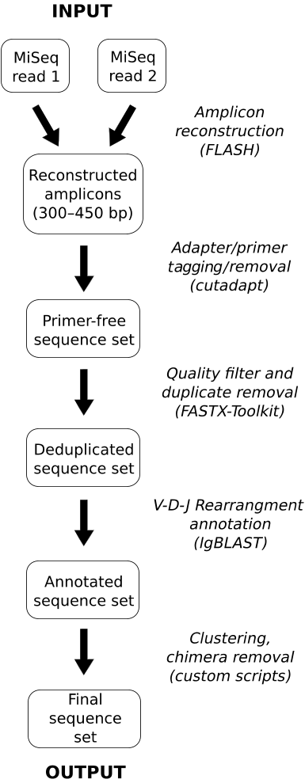

# ngs-ig

## _Description:_

This is a pipeline for trimming, filtering and annotation of next-gen sequencing (e.g., Illumina) data from rearranged immunoglobulin genes expressed in B-cell populations.

The pipeline is intended to run in a U\*nix environment (typically, a Linux flavor or macOS). To make setup easier, the pipeline is optimized for a container environment (see **Operation via Docker** below), which makes it deployable on other systems supported by Docker.

## _Acceptable input data:_

Typical datasets consist of forward and reverse reads generated from 500- or 600-cycle MiSeq kits (although exploratory data can be generated from shorter reads using the \*Nano workflows).

These reads are expected to cover an amplicon library spanning from the start of Framework 1 to the middle/end of Framework 4.
In addition, libraries generated using 5' RACE are expected to cover the 5' UTR and leader regions.

Currently human, mouse, and rhesus macaque species are supported.
Data containing UMI barcodes on the 5' end of the amplicon (generated using SMARTer RACE) are supported.

Such datasets are further analyzed to report UMI population structure (diversity).

As an extension, the pipeline can also process and annotate constant-region sequences containing either the V-(D)-J junction regions or 5' UMIs, enabling the matching with companion variable-region libraries.

For more information, please see [sample outputs](./deployment/data/sample_output) included with this repository.

## _Expected outputs:_

-   Graphical representation of read statistics indicate overall quality score for each cycle.

-   Pipeline statistics indicating the numbers of sequences accounted for at each major processing step are written in tabular and graphical formats representing either input reads or unique sequences (either deduplicated or UMI-clustered).

-   For datasets containing UMIs, dataset diversity is represented by plots of size and numbers of clusters of amplicons sharing the same UMI, a.k.a. molecular identifier groups (MIGs). These MIG population plots are generated for all UMI-containing sequences as well as for those containing productive rearrangements.

-   FASTA files containing deduplicated reconstructed amplicons and annotated with information describing the rearrangement (e.g., gene-segment usage, junction sequence, CDR3 sequence), as well as the reading frame and translation.

## _Information required for a pipeline run (in addition to the sequencing data):_

-   5' and 3' primer/adapter sequences (for trimming)

-   Library type: _variable_ or _HINGE_

-   Library construction method: fixed-orientation (oligo-adaptored) or symmetrically-adaptored (e.g., using NEBNext Adaptors or similar)

## _Library dataset naming conventions:_

The workflow for the pipeline is determined from dataset name (which is parsed into sample manifest) or from a user-provided SampleManifest.txt. The information described in the previous section (**Information required for a pipeline run**) is used to populate the fields, as follows:

`species`-`sample_id`-`...`-`library_method`-`library_type`-`3primers`-`chain`

-   **species**: _Mm_, _Rh_, _Hs_
-   **sample_id**: an arbitrary-format identification for the sample or subject
-   **'...'** denoted optional fields may be listed in LabSpecific.sh so they can be used to populate the sample manifest (a text file that is generated automatically, containing the library description)
-   **library_method**: _multiplexNEB_, _UMI5RACE_, _UMI5RACENEB_, _UMI5RACEASYM_
-   **library_type**: _variable_, _HINGE_, _variableNano_, _HINGENano_
-   **3primers**: 3' primers used for amplicon generation
-   **chain**: _IgG_, _IgM_, _IgK_, _IgL_

### _An example:_

`Hs`-**29343**-**IMRAS**-**p16wk**-**CD3mIgGp**-`UMI5RACENEB`-`variableNano`-`HsRhIgGCH1Rev`-`IgG`

This name describes a library that came from a human (__Hs__) subject _29343_ from the IMRAS study (_IMRAS_ optional field) collected at 16 weeks post-immunization (_p16wk_ optional field).

The biological sample consisted of CD3-IgG+ sorted cells (_CD3mIgGp_ optional field).

The library contains an UMI and was prepared using 5' RACE followed by adaptoring using the NEBNext kit (__UMI5RACENEB__). This is a library targeting the variable-segment and is not expected to result in complete coverage (__variableNano__ field).

The 3' primer expected is __HsRhIgGCH1Rev__. This library is expected to contain IgG sequences (__IgG__ field).

## _Data setup checklist:_

- [x] An appropriately-named dataset subdirectory (see naming conventions above), placed in a `date` directory (e.g., 20200826)
- [x] A subdirectory named `input` containing Read1 and Read2 FASTQ files placed in the dataset subdirectory
- [x] A subdirectory named `scripts` containing the pipeline scripts placed in the dataset subdirectory (if using a docker container, this is optional, as it may be provided by the container). You may leave out the “deployment” subdirectory since it is only needed during the Docker build step.

## _Operation via Docker (recommended):_

A pre-built image may be found on [docker hub](https://hub.docker.com/r/vladimirvig/ngs-ig).

### _Building:_

Installation requires an active [Docker](https://www.docker.com/) instance.
Build from the directory containing Dockerfile:

    docker build . --tag=ngs-ig:latest

### _Testing:_

This script will execute a run using sample input data included in the repository (a murine IgG variable-region UMI5RACENEB data set).

    docker run -it --rm ngs-ig:latest

If you wish to examine the full output, please provide an empty directory.

    docker run -it --rm --mount type=bind,src=abs_path_to_empty_directory,dst=/mnt ngs-ig:latest

### _Running:_

    docker run -it --rm --mount type=bind,src=abs_path_to_data_directory,dst=/mnt ngs-ig:latest bash execute.sh date/dataset_name

If you provide your own scripts directory (e.g., to avoid rebuilding a container after a pipeline update), the one included in the data directory will be used.

Live container access (for manual operation or data re-processing):

    docker run -it --rm --mount type=bind,src=abs_path_to_data_directory,dst=/mnt ngs-ig:latest bash

## _(Stand-alone operation) software requirements:_

In addition to shell (bash) and scripting language support (perl), the pipeline requires local installations of the following open-source programs:

-   [FLASH](http://ccb.jhu.edu/software/FLASH/), see the [reference](http://www.ncbi.nlm.nih.gov/pubmed/21903629)

-   [cutadapt](https://cutadapt.readthedocs.io/en/stable/), see the [reference](<http://journal.embnet.org/index.php/embnetjournal/article/view/200>)

-   [FASTX-toolkit](http://hannonlab.cshl.edu/fastx_toolkit/index.html)

-   [IgBLAST](https://ncbi.github.io/igblast/), [download](ftp://ftp.ncbi.nih.gov/blast/executables/igblast/release/), see the [reference](http://www.ncbi.nlm.nih.gov/pubmed/23671333)

-   [R](https://www.r-project.org/) (4.1.0, [Bioconductor](https://www.bioconductor.org/), packages: _dada2_, _optparse_, _here_, _ggplot2_)

-   (optional) [BLAST](https://blast.ncbi.nlm.nih.gov/Blast.cgi?PAGE_TYPE=BlastDocs&DOC_TYPE=Download), [download](https://ftp.ncbi.nih.gov/blast/executables/)

## _(Stand-alone operation) running the pipeline:_

1.  Name a top-level project directory with the run date and create a subdirectory for each library.
2.  Name the library subdirectory according to the naming conventions described below.
3.  deposit gzipped FASTQ files for forward and reverse reads into a subdirectory named `input`, within the library subdirectory.
4.  Copy the contents of the `pipeline` directory into an empty subdirectory named `scripts`.
5.  Edit the `ngs-ig_pipeline_alias.sh` file to point to the correct locations of the installations of required software (see above).
6.  Edit the `LabSpecific.sh` script to add custom values.
7.  Add the appropriate oligonucleotide sequences to the scripts/adapters/primers directory and/or edit the `*.conf` files found in scripts/adapters.
8.  Once the steps above are completed, type `bash go.sh` from the scripts subdirectory.

The pipeline operates in the background and the log file may be monitored (`tail -f run.log`).

## _Citation:_

Publication describing this pipeline may be found here: <https://pubmed.ncbi.nlm.nih.gov/27525066/>

If you find this software useful, please use the following citation:

V. Vigdorovich, B. G. Oliver, S. Carbonetti, N. Dambrauskas, M. D. Lange, C. Yacoob, W. Leahy, J. Callahan, L. Stamatatos, D. N. Sather, Repertoire comparison of the B-cell receptor-encoding loci in humans and rhesus macaques by next-generation sequencing. Clin Transl Immunology 5, e93 (2016).

